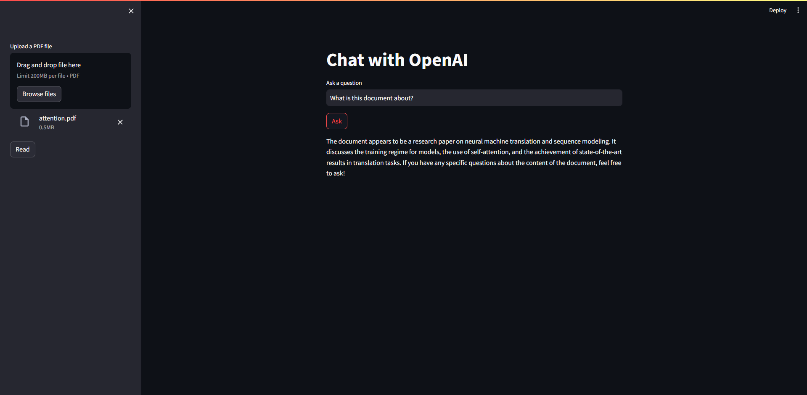

# Q-A-RAG-chatbot
A simple Q&amp;A with (Multi-Resource) RAG using langchain, chroma, OpenAI and streamlit.

---
## Streamlit App


---
## Setup

### 1. Create and activate a conda environment:
```bash
conda create -n <environment_name> python=3.8 -y
```
```bash
conda activate <environment_name> 
```

### 2. Install requirements:
```bash
pip install -r requirements.txt
```

### 3. Set up environment variables
Create a `.env` file and add your `OPENAI_API_KEY`.

---
## How to run
In a terminal, use this command:
```bash
streamlit run app.py
```

## How to use
Simply upload a PDF file and press the `read` button. You are ready to ask questions!

